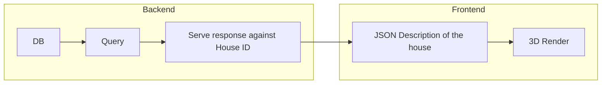

# Objective

Design of a 3D Single page application for customization of houses.

> ⚠️ Do not build individual apps, instead always build the monorepo from the root directory of the repo

## Stack

- Typescript: This project uses TS on both frontend and backend

### Frontend

- Nextjs
- Tailwind for UI
- Zustand for Global State
- React Query for Data fetching and caching on the frontend
- Babylonjs for 3D

### Backend

- Nextjs API routes for backend
- Tailwind for MySQL hosting
- MySQL Db
- Prisma for ORM
- Zod for json validation
- TRPC for Typesafe communication between frontend and backend

